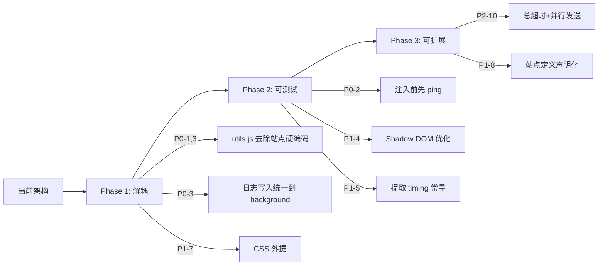

# AI2tab Chrome 扩展 — 代码审查与整改意见

## 项目概览

| 文件 | 行数 | 职责 |
|------|------|------|
| [manifest.json](file:///c:/Users/Administrator/Desktop/AITabPlugin%20-%20%E5%89%AF%E6%9C%AC/manifest.json) | 62 | MV3 配置：权限、host_permissions、Service Worker |
| [ai-sites.js](file:///c:/Users/Administrator/Desktop/AITabPlugin%20-%20%E5%89%AF%E6%9C%AC/ai-sites.js) | 328 | 站点定义表 + URL 匹配工具函数 |
| [utils.js](file:///c:/Users/Administrator/Desktop/AITabPlugin%20-%20%E5%89%AF%E6%9C%AC/utils.js) | 419 | DOM 操作 / 输入填写 / 等待轮询等底层工具 |
| [content.js](file:///c:/Users/Administrator/Desktop/AITabPlugin%20-%20%E5%89%AF%E6%9C%AC/content.js) | 505 | Content Script：识别平台 → 新建对话 → 填写 → 提交 |
| [background.js](file:///c:/Users/Administrator/Desktop/AITabPlugin%20-%20%E5%89%AF%E6%9C%AC/background.js) | 508 | Service Worker：Tab 管理 / 注入 / 重试 / 日志 |
| [popup.html](file:///c:/Users/Administrator/Desktop/AITabPlugin%20-%20%E5%89%AF%E6%9C%AC/popup.html) + [popup.js](file:///c:/Users/Administrator/Desktop/AITabPlugin%20-%20%E5%89%AF%E6%9C%AC/popup.js) | 486+440 | 弹窗 UI：文本/图片发送、站点偏好、历史、日志 |

---

## P0 — 严重问题（建议立即修复）

### 1. `utils.js` 中 `setInput()` 硬编码站点名，严重耦合

[utils.js:217-260](file:///c:/Users/Administrator/Desktop/AITabPlugin%20-%20%E5%89%AF%E6%9C%AC/utils.js#L217-L260)

```js
if (siteName === '千问/Qwen') { ... }
if (siteName === '豆包' && ...) { ... }
if (siteName === 'Kimi') { ... }
```

> [!CAUTION]
> 工具层（utils.js）不应感知具体站点名称。这导致：
> - 站点改名即断裂
> - 新增站点需同时改 `ai-sites.js` + `utils.js`
> - 单元测试困难

**整改方案**：将差异化逻辑抽成 **策略对象** 放在站点定义里：

```js
// ai-sites.js 中为每个站点增加
inputStrategy: 'reactNativeSetter' | 'execCommand' | 'default'

// utils.js 中按 strategy 分发，不再按 siteName 分发
function setInput(element, value, strategy = 'default') { ... }
```

---

### 2. 每次 `injectAndSendMessage` 都重复注入 3 个脚本

[background.js:281-284](file:///c:/Users/Administrator/Desktop/AITabPlugin%20-%20%E5%89%AF%E6%9C%AC/background.js#L281-L284)

```js
chrome.scripting.executeScript({
  target: { tabId },
  files: ['ai-sites.js', 'utils.js', 'content.js'],
}, ...);
```

> [!WARNING]
> 每次消息都 executeScript 三次，`content.js` 虽然有版本守卫但 `ai-sites.js` 和 `utils.js` 每次都会重新执行。
> - 产生不必要的性能开销
> - `AI2TAB_SITE_CONFIG` 会被反复覆盖（虽然内容相同但不优雅）

**整改方案**：
- 先 `sendMessage` 尝试通信，若失败再 `executeScript` 一次
- 或在 content.js 开头检查是否已有 `TabPluginUtils`，有则跳过

---

### 3. `popup.js` 中 `saveSendLog` 与 `background.js` 中的同名函数重复

- [popup.js:261-267](file:///c:/Users/Administrator/Desktop/AITabPlugin%20-%20%E5%89%AF%E6%9C%AC/popup.js#L261-L267) — popup 端的 `saveSendLog`
- [background.js:351-357](file:///c:/Users/Administrator/Desktop/AITabPlugin%20-%20%E5%89%AF%E6%9C%AC/background.js#L351-L357) — background 端的 `saveSendLog`

两个函数逻辑完全一样，且操作同一个 storage key，可能导致 **竞态写覆盖**（background 写了一条，popup 紧接着也写了一条，互相覆盖）。

**整改方案**：日志写入统一由 background 完成；popup 只读取日志、不写入。

---

## P1 — 重要问题（建议近期修复）

### 4. `deepQuerySelectorAll` 遍历所有 DOM 元素查找 Shadow DOM

[utils.js:78-92](file:///c:/Users/Administrator/Desktop/AITabPlugin%20-%20%E5%89%AF%E6%9C%AC/utils.js#L78-L92)

```js
const allElements = root.querySelectorAll('*');
for (const host of allElements) {
  if (host.shadowRoot) { ... }
}
```

> [!WARNING]
> `querySelectorAll('*')` 在复杂页面（如 ChatGPT）会返回数千个节点，递归进入所有 shadow root 性能堪忧。

**整改方案**：
- 记录已知的 shadow host 选择器（如 `gemini-app`, `rich-textarea`），只深入目标 shadow root
- 或增加一个最大深度限制，避免无限递归

---

### 5. Magic Number 散落各处

```
350ms   → injectAndSendMessageOnce 中的 setTimeout
550ms   → writePrompt 中的 delay
700ms   → submit 中的 delay
900ms   → maybeNavigateToFreshUrl 中的额外 delay
1200ms  → 多处
1500ms  → ensureTabReadyQuietly
```

**整改方案**：在 `ai-sites.js` 的站点定义中增加 `timing` 配置对象，或在 utils.js 中导出命名常量：

```js
const TIMING = {
  AFTER_INJECT: 350,
  AFTER_WRITE: 550,
  AFTER_SUBMIT: 700,
  AFTER_RELOAD: 1200,
};
```

---

### 6. `content.js` 中 `handleMessage` 的错误处理不一致

[content.js:449-488](file:///c:/Users/Administrator/Desktop/AITabPlugin%20-%20%E5%89%AF%E6%9C%AC/content.js#L449-L488)

- `sendMessage` 和 `generateImage` 使用 async/catch 模式
- `ping` 和 `diagnoseModes` 是同步返回
- 未处理未知 action 的情况（直接 `return false`，不给 response）

**整改方案**：统一用 try/catch 包裹所有分支，对未知 action 返回 `{ success: false, error: 'Unknown action' }`。

---

### 7. `popup.html` 将 CSS 全部内联，不利于维护

[popup.html:6-411](file:///c:/Users/Administrator/Desktop/AITabPlugin%20-%20%E5%89%AF%E6%9C%AC/popup.html#L6-L411)

405 行 CSS 内联在 HTML 中，占整个文件 84%。

**整改方案**：抽出为 `popup.css`，HTML 中用 `<link rel="stylesheet" href="popup.css">` 引入。

---

### 8. `IMAGE_SITE_IDS` 列出了所有站点，图片能力区分不明确

[ai-sites.js:276](file:///c:/Users/Administrator/Desktop/AITabPlugin%20-%20%E5%89%AF%E6%9C%AC/ai-sites.js#L276)

```js
const IMAGE_SITE_IDS = ['chatgpt', 'gemini', 'grok', 'qwen', 'doubao', 'kimi'];
```

这个列表跟 `SITE_DEFINITIONS` 完全一致，且只有 `grok` 有单独的 `imageMatch`。其余站点实际上是用 text 输入框发 "请生成图片：" 前缀。

**整改方案**：在站点定义中加 `supportsImage: true/false` 字段，去掉冗余的独立 ID 列表。

---

## P2 — 改进建议（提升质量）

### 9. `manifest.json` host_permissions 冗余

[manifest.json:12-41](file:///c:/Users/Administrator/Desktop/AITabPlugin%20-%20%E5%89%AF%E6%9C%AC/manifest.json#L12-L41)

- `*://doubao.com/*` 和 `*://www.doubao.com/*` 和 `*://*.doubao.com/*` 三条覆盖关系重复
- `*://*.chatgpt.com/*` 已经覆盖了 `*://chatgpt.com/*`

**整改方案**：每个域名只保留 `*://*.domain.com/*` 即可。

---

### 10. 缺少错误边界和超时上限保护

`runForTabs` 对每个 tab 串行执行且无总超时：

[background.js:362-386](file:///c:/Users/Administrator/Desktop/AITabPlugin%20-%20%E5%89%AF%E6%9C%AC/background.js#L362-L386)

如果有 6 个 tab，每个最坏 `ensureTabReadyQuietly` 22s + `prepareTabForSend` 18s + retry 18s ≈ **58s/tab × 6 = 5.8 分钟**。MV3 Service Worker 的空闲生命周期为 5 分钟可能被终止。

**整改方案**：
- 增加总超时 `Promise.race` 保护
- 考虑将串行改为有限并发（如 2-3 个并行）

---

### 11. `tabRank` 中的魔法数字

[background.js:27-33](file:///c:/Users/Administrator/Desktop/AITabPlugin%20-%20%E5%89%AF%E6%9C%AC/background.js#L27-L33)

```js
if (tab.active) score += 1000000000000;
if (!tab.discarded) score += 1000000000;
```

**整改方案**：改用带名称的常量或注释说明设计意图。

---

### 12. `utils.js` 的 `DEBUG = true` 硬编码

[utils.js:2](file:///c:/Users/Administrator/Desktop/AITabPlugin%20-%20%E5%89%AF%E6%9C%AC/utils.js#L2)

```js
const DEBUG = true;
```

生产环境不应默认开启 debug log。

**整改方案**：从 `chrome.storage.local` 读取或使用构建时环境变量。

---

### 13. 缺少输入合法性校验

`popup.js` 中 `sendMessage` / `generateImage` 只检查了是否为空，没有检查最大长度。如果用户粘贴巨量文本，可能导致填写阶段失败。

**整改方案**：增加字符数上限（如 30,000），超出时提示用户。

---

### 14. 可访问性改进

- Tab 控件用 `<div>` 模拟但没有 `tabindex`/键盘支持
- 历史列表的 `<button>` 没有可访问名称
- `aria-live` 只在 status 上有，发送日志区域没有

---

### 15. 版本号不一致

| 位置 | 版本 |
|------|------|
| manifest.json | `3.0.0` |
| content.js `CONTENT_VERSION` | `3.0.0` |
| utils.js `UTILS_VERSION` | `2.0.0` |

**整改方案**：统一版本号，或从 manifest 中动态读取。

---

## 架构改进路线图



---

## 总结

| 等级 | 数量 | 核心主题 |
|------|------|---------|
| **P0 严重** | 3 | 站点耦合、重复注入、竞态写覆盖 |
| **P1 重要** | 5 | 性能、一致性、可维护性 |
| **P2 建议** | 7 | 代码风格、可访问性、健壮性 |

整体来看，这个扩展的**功能设计和错误重试策略做得不错**（多级重试、前台兜底、日志记录），但**耦合度偏高**，尤其是 `utils.js` 中的站点硬编码和 popup/background 之间的日志写入重复是最需要优先解决的问题。

---

## v3.2.0 技术重点与规范化成果

在 v3.2.0 迭代中，我们对项目进行了深度的规范化改造，攻克了历史版本中高耦合、少反馈、潜在性能瓶颈等技术债。

### 1. 声明式生命周期 Hook 与绝对解耦架构
* **痛点**：以往 `content.js` 包含大量平台定制代码（如豆包专用的输入策略、清空流程和异常处理），导致脚本极度臃肿。
* **解决**：在 `ai-sites.js` 的站点配置中引入了**生命周期钩子（Hooks）**（例如 `customRunAction`）。我们将原先 `content.js` 中所有对豆包的专属兼容代码安全迁移至 `ai-sites.js` 内。
* **收益**：`content.js` 代码量减少近 45%，只保留通用 DOM 寻址和页面驱动。以后新增或适配更新站点时，只需在 `ai-sites.js` 声明规则或 Hook，无须破坏性更改通用代码。

### 2. 限制并发数 = 2 的异步 Worker 任务队列
* **痛点**：若用户同时开启并启用 5 个以上的 AI 站点，后台完全并行 Reload 并派发消息容易使低配置电脑卡死，或者因为多页面同时抢占聚焦导致某些站点的 DOM 选择器失效。
* **解决**：在 `background.js` 中摒弃了传统的 `Promise.all` 并发，设计并实现了一个最大并发数限制为 `2` 的轻量级** Worker 任务消费队列**。
* **收益**：既保证了整体流程的吞吐速率（耗时相比纯串行减少约 40%），又确保了每个页面 Reload 及重试时的绝对独占稳定性。

### 3. 实时进度推送通道与自适应 UI 渲染
* **痛点**：发送任务可能耗时 10s 以上，用户在此期间面对置灰的发送按钮只能盲等，容易产生死机错觉。
* **解决**：
  * 后台发送的各个关键状态节点（`waiting` / `preparing` / `sending` / `success` / `error` / `skipped`）全部实时向 Popup 广播进度数据包。
  * Popup 自适应网格布局由两列升级为三列网格，动态加载状态徽标。
  * 引入不同状态下的个性化文字颜色，支持悬停显示错误堆栈。
* **收益**：界面具有极佳的交互活性与高级质感，执行状态一目了然。

